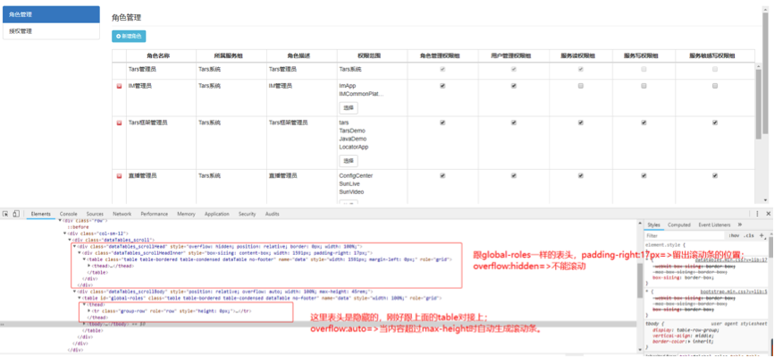
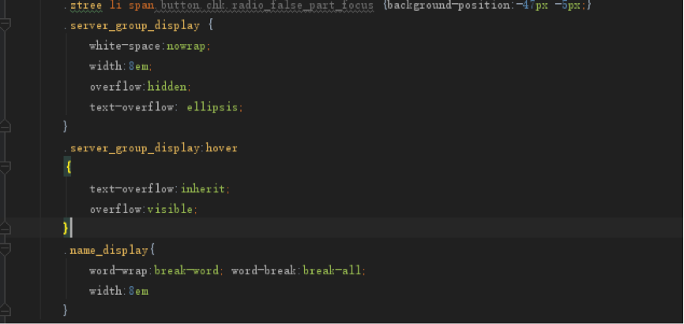

# 开发总结

静态表格有很多表头固定的插件可以用。

css实现：https://blog.csdn.net/yiifaa/article/details/52104698

jquery插件

 [freezeheader.js](http://www.htmleaf.com/jQuery/Table/2014100659.html) 

[fixedheadertable.js](http://www.jq22.com/jquery-info10153)

但是表格的内容是动态生成的，在表头固定时会经常会遇到表头和内容不对齐的问题。

 

## fixedtableheader.js

尝试一：整个表格生成完以后再用该插件包装一下实现表头固定。结果发现表头和内容没有对齐。

尝试二：每添加一行就把表重新使用该插件生成一遍，大多数时候都能对齐，但是后来发现在遇到特殊数据时又不能对齐了。

尝试三：分析了一下它的生成结果，有好几列的width:0px; 猜想可能是因为这个原因导致的，但是没有时间看它底层实现原理，所以放弃该插件，去寻找新的解决方式。于是就找到了datatables.fixedColumns插件。

## data tables.fixedColumns

最后采用datatables插件解决了表头固定中的问题。

 

后来新增角色后又出现表头和内容不对齐的问题，经过排查是因为权限范围的业务线名称太长，于是尝试采用固定宽度，超过长度显示…，鼠标移过去显示完整的名称。

角色名称太长采用的换行显示。 

